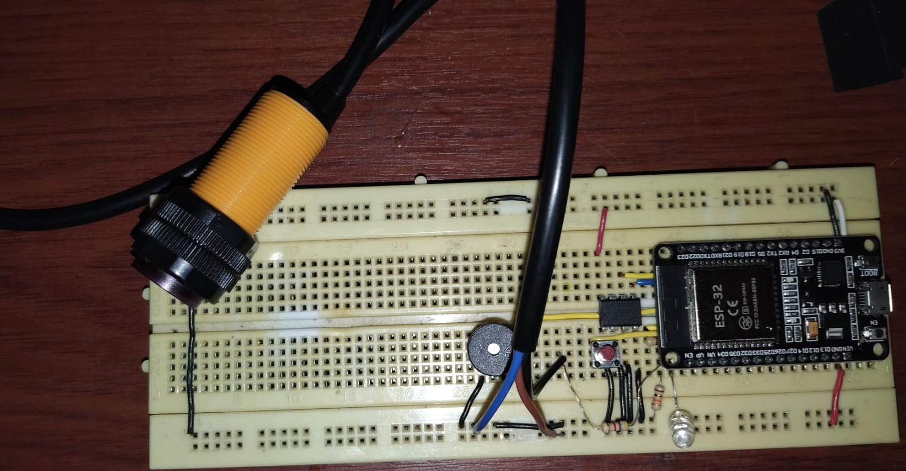
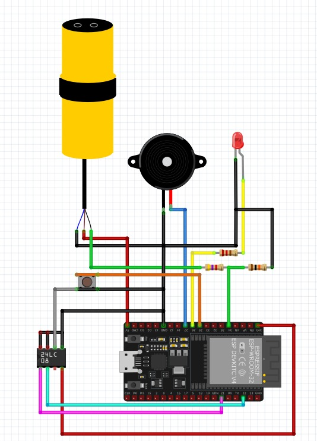

# 🔔 Alarma IoT con ESP32 + EEPROM externa 24C08 + RTOS + I2C

Danny Harvey Lopez Lopez - 55622029

Proyecto de una **alarma IoT** implementada en un **ESP32**, con almacenamiento de eventos en una **EEPROM externa 24C08** mediante el protocolo **I2C**, conectividad WiFi y comunicación por **MQTT**.  
El sistema se organiza con un **RTOS** (Sistema Operativo en Tiempo Real) para manejar tareas críticas, comunicación, almacenamiento y control de usuario.

---

## 📑 Índice

1. [Componentes](#-componentes)  
2. [Funcionalidades principales](#-funcionalidades-principales)  
3. [Explicación de los temas](#-explicación-de-los-temas)  
   - [EEPROM](#eeprom)  
   - [RTOS](#rtos)  
   - [I2C](#i2c)  
4. [Diagramas de conexión](#-diagramas-de-conexión)  
5. [Configuración por defecto](#-configuración-por-defecto)  
6. [Simulación y pruebas](#-simulación-y-pruebas)  
7. [Resultados](#-resultados)  
8. [Conclusiones](#-conclusiones)  

---

## 🛠️ Componentes

- ESP32 DevKit v1  
- Sensor de proximidad **E18-D80NK (NPN)**  
- EEPROM I2C **24C08**  
- 1 LED + resistencia de 220 Ω  
- 1 pulsador + resistencia de pull-down/pull-up  
- 1 buzzer activo  
- Resistencias varias para el circuito  

---

## 📡 Funcionalidades principales

1. **Detección de intrusiones** con el sensor E18-D80NK.  
2. **Alarma sonora y visual** mediante buzzer y LED.  
3. **Control remoto por MQTT**:
   - `alarma/control` → ARMAR / DESARMAR / FORZAR  
   - `alarma/status` → Estado actual de la alarma  
   - `alarma/evento` → Eventos de detección e intrusión  
   - `alarma/eeprom1/read` → Lectura de logs almacenados en EEPROM  
4. **Logs en EEPROM externa (24C08)** para guardar eventos con marca de tiempo.  
5. **Botón físico** para alternar entre ARMADO y DESARMADO.  
6. **Conexión WiFi + MQTT seguro (TLS/SSL)** con HiveMQ Cloud.  
7. **Gestión con RTOS** para asegurar prioridades de ejecución.  

---

## 📚 Explicación de los temas

### EEPROM
- Es una memoria no volátil (Electrically Erasable Programmable Read-Only Memory).  
- Conserva la información aunque se apague el sistema.  
- En este proyecto se utiliza para almacenar **eventos de la alarma y configuraciones**.  
- Se accede a través del protocolo **I2C**.  

### RTOS
- Un **RTOS (Real-Time Operating System)** permite ejecutar varias tareas en paralelo, garantizando tiempos de respuesta.  
- Orden de importancia de las tareas:  
  1. **Tareas críticas** → Interrupciones del sensor y eventos de alarma.  
  2. **Tareas de comunicación** → MQTT e I2C.  
  3. **Tareas de almacenamiento** → Escritura y lectura en EEPROM.  
  4. **Tareas de usuario** → LED, buzzer y pulsador.  

### I2C
- Protocolo de comunicación serial síncrona de **dos hilos**:  
  - **SDA** (Serial Data).  
  - **SCL** (Serial Clock).  
- El ESP32 actúa como **maestro** y la EEPROM como **esclavo**.  
- Permite escritura y lectura de datos en secuencia con confirmaciones.  

---

## 📐 Diagramas de conexión

- **Circuito físico**  
    

- **Simulación (Fritzing / Proteus / Wokwi)**  
    

### Pines usados en el ESP32

| Componente | Pin ESP32 | Descripción |
|------------|-----------|-------------|
| E18-D80NK  | GPIO34    | Salida sensor (entrada digital) |
| Botón      | GPIO25    | Entrada con interrupción |
| LED        | GPIO26    | Indicador de estado |
| Buzzer     | GPIO27    | Alarma sonora |
| EEPROM SDA | GPIO21    | I2C SDA |
| EEPROM SCL | GPIO22    | I2C SCL |

---

## ⚙️ Configuración por defecto

- SSID y contraseña WiFi predefinidos.  
- Dirección del broker MQTT seguro en HiveMQ Cloud.  
- Usuario y contraseña para autenticación TLS/SSL.  

---

## 🔬 Simulación y pruebas

- **En simulación:**  
  - Escritura de datos en la EEPROM.  
  - Lectura posterior para verificar el almacenamiento.  
  - Pruebas de comunicación MQTT.  

- **En montaje físico:**  
  - Confirmación de detección de intrusos con el sensor E18-D80NK.  
  - Validación del almacenamiento en EEPROM tras reinicios del ESP32.  
  - Control de la alarma por **botón físico** y por **MQTT**.  
  - Uso de FreeRTOS del ESP32 para priorizar las tareas.  

---

## ✅ Resultados

- Comunicación estable con la **EEPROM 24C08** usando I2C.  
- **Datos persistentes** en memoria tras reinicios.  
- **Gestión de tareas con RTOS**, garantizando confiabilidad en detección, comunicación y almacenamiento.  
- Control exitoso tanto local (botón) como remoto (MQTT).  

---

## 📌 Conclusiones

- La integración de **RTOS con I2C y EEPROM** permitió un sistema **robusto y confiable**.  
- **EEPROM** es fundamental para guardar configuraciones y logs que persisten tras apagados.  
- El **protocolo I2C** simplifica la conexión entre múltiples dispositivos con solo dos líneas.  
- El uso de **RTOS** asegura que las tareas críticas (detección de intrusos) siempre tengan prioridad.  
- El sistema combina **detección, almacenamiento y comunicación en tiempo real**, lo que lo hace escalable para proyectos IoT más complejos.  
