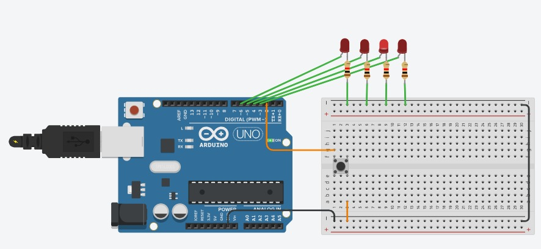

# Ejercicio 2 - Reto 1 - Arduino

Este proyecto corresponde al **Reto 1** de ejercicios con Arduino.  
Incluye un diagrama del circuito, el código fuente en Arduino y un enlace al diseño en Tinkercad.  

---

## 📂 Archivos del proyecto

- `reto1.ino` → Código en Arduino.
- `assets/reto1.png` → Imagen del circuito.
- `README.md` → Documentación del proyecto.

---

## 📝 Descripción

### Contador con botón (Interrupción externa)
- Descripción: Conectar un pulsador al pin 2 (INT0). Cada vez que se presione, incrementar un contador.
- Requisito extra: Mostrar el valor en el puerto serial.
- Objetivo: Comprender cómo usar interrupciones externas para responder a eventos asincrónicos evitando el polling.

El diseño se puede visualizar tanto en la imagen incluida como en la simulación en Tinkercad.

---

## 🖼️ Circuito

---

## 🔗 Simulación en Tinkercad

Puedes ver y simular el circuito en el siguiente enlace:  
👉 [Abrir en Tinkercad](https://www.tinkercad.com/things/kdmRuAbJCYM-reto-21)

---

✍️ Autor: Danny
