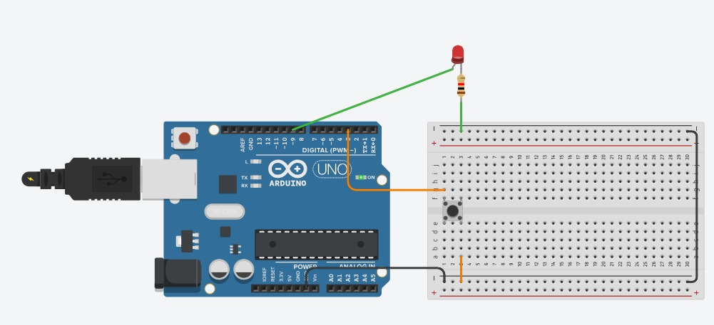

# Ejercicio 2 - Reto 2 - Arduino

Este proyecto corresponde al **Reto 2** de ejercicios con Arduino.  
Incluye un diagrama del circuito, el código fuente en Arduino y un enlace al diseño en Tinkercad.  

---

## 📂 Archivos del proyecto

- `reto2.ino` → Código en Arduino.
- `assets/reto2.png` → Imagen del circuito.
- `README.md` → Documentación del proyecto.

---

## 📝 Descripción

### Reto 2: Control de PWM con interrupción
- Descripción: Usar analogWrite() en un pin PWM para controlar la intensidad de un LED.
- Con un botón en el pin 3 (INT1), invertir la dirección del cambio:
- Si estaba aumentando el brillo, ahora disminuye.
- Si estaba disminuyendo, ahora aumenta.
- Objetivo: Combinar interrupciones externas con la generación de señales PWM.

El diseño se puede visualizar tanto en la imagen incluida como en la simulación en Tinkercad.

---

## 🖼️ Circuito

---

## 🔗 Simulación en Tinkercad

Puedes ver y simular el circuito en el siguiente enlace:  
👉 [Abrir en Tinkercad](https://www.tinkercad.com/things/hai849uieuV-reto-22)

---

✍️ Autor: Danny
