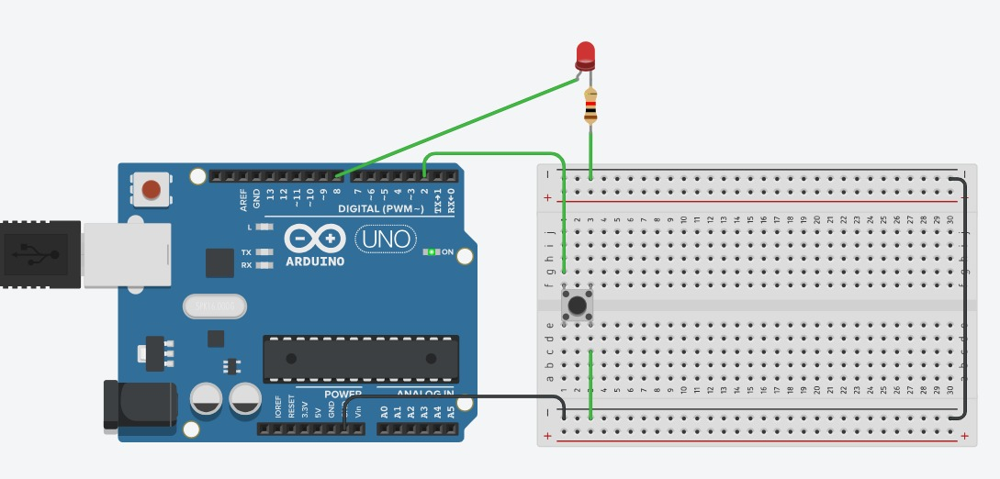

# Ejercicio 2 - Reto 4 - Arduino

Este proyecto corresponde al **Reto 4** de ejercicios con Arduino.  
Incluye un diagrama del circuito, el código fuente en Arduino y un enlace al diseño en Tinkercad.  

---

## 📂 Archivos del proyecto

- `reto4.ino` → Código en Arduino.
- `assets/reto4.png` → Imagen del circuito.
- `README.md` → Documentación del proyecto.

---

## 📝 Descripción

### Reto 4: Medición de frecuencia de una señal externa

 - Conectar un sensor que genere pulsos (ej. sensor de efecto Hall, encoder, o un simple botón).
 - Configurar una interrupción externa en el pin 2 para contar pulsos.
 - Usar un timer interno que genere interrupción cada 1 segundo.
 - Al cumplirse, calcular y mostrar la frecuencia (pulsos/segundo) en el monitor serial.
- Objetivo: Combinar interrupciones externas e internas para medir frecuencia.

El diseño se puede visualizar tanto en la imagen incluida como en la simulación en Tinkercad.

---

## 🖼️ Circuito

---

## 🔗 Simulación en Tinkercad

Puedes ver y simular el circuito en el siguiente enlace:  
👉 [Abrir en Tinkercad](https://www.tinkercad.com/things/iURr2MkZ2IL-reto-24)

---

✍️ Autor: Danny
