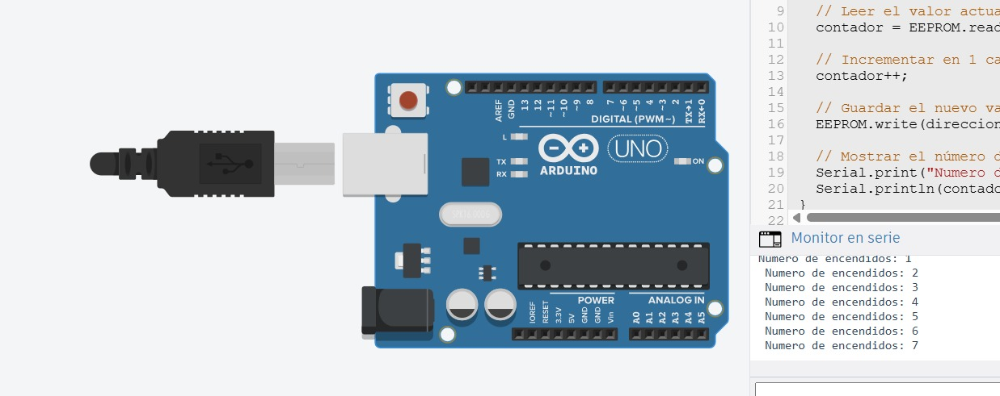

# Ejercicio 3 - Reto 1 - Arduino

Este proyecto corresponde al **Reto 1** de ejercicios con Arduino.  
Incluye un diagrama del circuito, el código fuente en Arduino y un enlace al diseño en Tinkercad.  

---

## 📂 Archivos del proyecto

- `reto1.ino` → Código en Arduino.
- `assets/reto1.png` → Imagen del circuito.
- `README.md` → Documentación del proyecto.

---

## 📝 Descripción

### Reto 1: Contador Persistente de Encendidos
Objetivo:
- Programar el Arduino para que cuente cuántas veces se ha encendido el sistema y almacenar este valor en la EEPROM.

Descripción:
Cada vez que el Arduino se energiza, debe:
- Leer el valor actual del contador desde la EEPROM.
- Incrementar el contador en 1.
- Guardar el nuevo valor en la EEPROM.
- Mostrar el número de encendidos por el puerto serie.

Puntos a considerar:
- Usar EEPROM.read() y EEPROM.write().
- Evitar escribir en cada ciclo del loop(), solo al iniciar.

El diseño se puede visualizar tanto en la imagen incluida como en la simulación en Tinkercad.

---

## 🖼️ Circuito

---

## 🔗 Simulación en Tinkercad

Puedes ver y simular el circuito en el siguiente enlace:  
👉 [Abrir en Tinkercad](https://www.tinkercad.com/things/9c6riezCBqF-reto-31)

---

✍️ Autor: Danny
