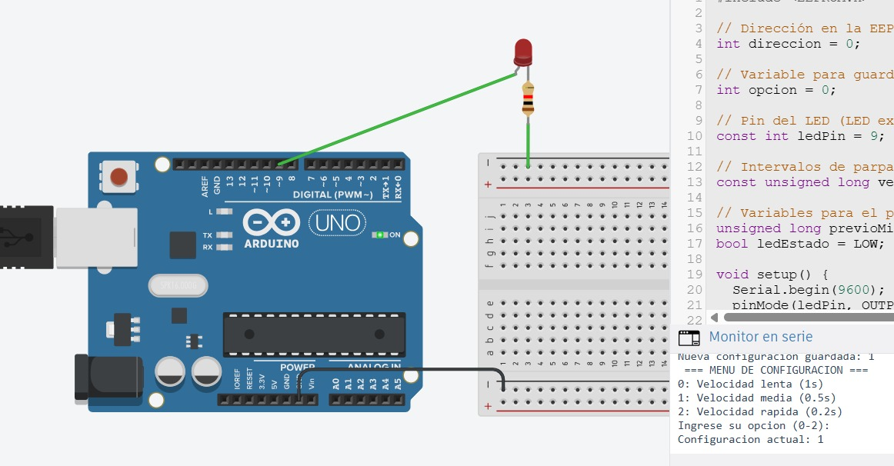

# Ejercicio 3 - Reto 2 - Arduino

Este proyecto corresponde al **Reto 2** de ejercicios con Arduino.  
Incluye un diagrama del circuito, el código fuente en Arduino y un enlace al diseño en Tinkercad.  

---

## 📂 Archivos del proyecto

- `reto2.ino` → Código en Arduino.
- `assets/reto2.png` → Imagen del circuito.
- `README.md` → Documentación del proyecto.

---

## 📝 Descripción

### Reto 2: Menú de Configuración Persistente
Objetivo:
- Diseñar un sistema de configuración simple que guarde los parámetros en la EEPROM y los restaure al reiniciar.

Descripción:
- El usuario, a través del puerto serie, debe poder elegir entre 3 opciones de configuración (ejemplo: velocidad de parpadeo de un LED: lenta, media, rápida).
- La opción seleccionada se guarda en la EEPROM.
- Al reiniciar el Arduino, debe leer la configuración almacenada y ejecutar el comportamiento correspondiente sin necesidad de volver a configurarlo.

Puntos a considerar:
- Usar EEPROM.put() y EEPROM.get() para almacenar variables.
- Crear un menú básico usando Serial.read().

El diseño se puede visualizar tanto en la imagen incluida como en la simulación en Tinkercad.

---

## 🖼️ Circuito

---

## 🔗 Simulación en Tinkercad

Puedes ver y simular el circuito en el siguiente enlace:  
👉 [Abrir en Tinkercad](https://www.tinkercad.com/things/4TAYmcmuGDp-reto-32)

---

✍️ Autor: Danny
