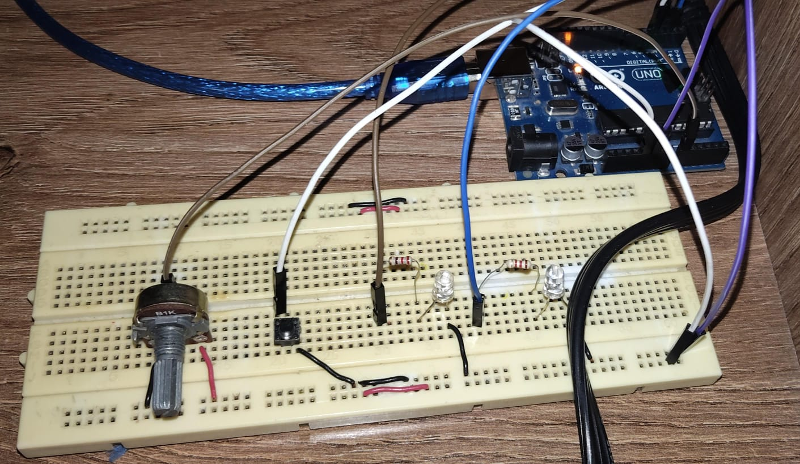

# Ejercicio 4 - Reto 2 - Arduino

Este proyecto corresponde al **Reto 2** de ejercicios con Arduino.  
Incluye un diagrama del circuito, el código fuente en Arduino y un enlace al diseño en Tinkercad.  

---

## 📂 Archivos del proyecto

- `reto2.ino` → Código en Arduino.
- `assets/reto2.png` → Imagen del circuito.
- `README.md` → Documentación del proyecto.

---

## 📝 Descripción

### Reto 2: Tareas con diferentes prioridades
Objetivo: 
- Comprender cómo RTOS asigna CPU a las tareas según su prioridad.

Descripción:
- Crear tres tareas:
- Tarea de baja prioridad: parpadeo de LED cada 1000 ms.
- Tarea de prioridad media: leer un potenciómetro y mostrar el valor por Serial cada 500 ms.
- Tarea de alta prioridad: responder a la pulsación de un botón encendiendo un LED inmediatamente.
- Comparar qué pasa si todas las tareas tienen la misma prioridad vs. cuando se asignan prioridades distintas.

El diseño se puede visualizar tanto en la imagen incluida como en la simulación en Tinkercad.

---

## 🖼️ Circuito

---

✍️ Autor: Danny
