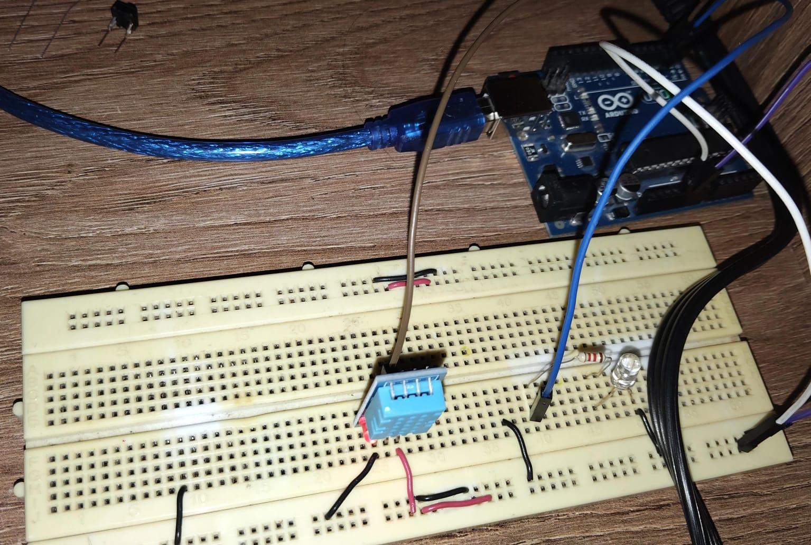

# Ejercicio 4 - Reto 4 - Arduino

Este proyecto corresponde al **Reto 4** de ejercicios con Arduino.  
Incluye un diagrama del circuito, el código fuente en Arduino y un enlace al diseño en Tinkercad.  

---

## 📂 Archivos del proyecto

- `reto4.ino` → Código en Arduino.
- `assets/reto4.png` → Imagen del circuito.
- `README.md` → Documentación del proyecto.

---

## 📝 Descripción

### Reto 4: Colas de mensajes para comunicación entre tareas
Objetivo: 
- Entender cómo las tareas se comunican de manera ordenada.

- Crear una tarea de lectura de sensor (por ejemplo, temperatura con un DHT11).
- Esta tarea envía los valores a través de una cola a otra tarea.
- La tarea de procesamiento recibe los datos de la cola y:
- Los muestra en Serial.
- Enciende un LED si la temperatura pasa cierto umbral.
- Implementar además una tarea de "monitoreo" que corra en paralelo y muestre un "sistema en funcionamiento".

El diseño se puede visualizar tanto en la imagen incluida como en la simulación en Tinkercad.

---

## 🖼️ Circuito

---

✍️ Autor: Danny
