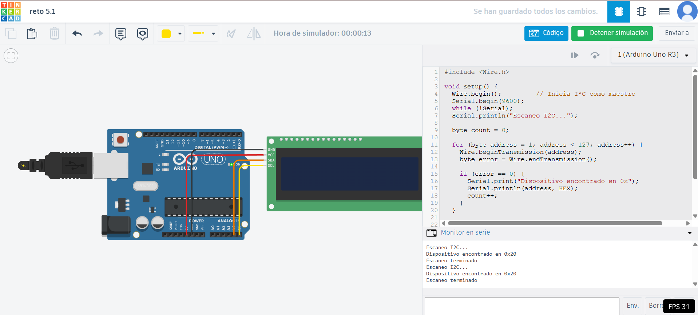

# Ejercicio 5 - Reto 1 - Arduino

Este proyecto corresponde al **Reto 1** de ejercicios con Arduino.  
Incluye un diagrama del circuito, el código fuente en Arduino y un enlace al diseño en Tinkercad.  

---

## 📂 Archivos del proyecto

- `reto1.ino` → Código en Arduino.
- `assets/reto1.png` → Imagen del circuito.
- `README.md` → Documentación del proyecto.

---

## 📝 Descripción

### Escaneo de dispositivos: 
- Realiza un programa que detecte y muestre en pantalla todos los dispositivos I²C conectados.

El diseño se puede visualizar tanto en la imagen incluida como en la simulación en Tinkercad.

---

## 🖼️ Circuito

---

## 🔗 Simulación en Tinkercad

Puedes ver y simular el circuito en el siguiente enlace:  
👉 [Abrir en Tinkercad](https://www.tinkercad.com/things/0UFQzxEOt2w-reto-51)

---

✍️ Autor: Danny
