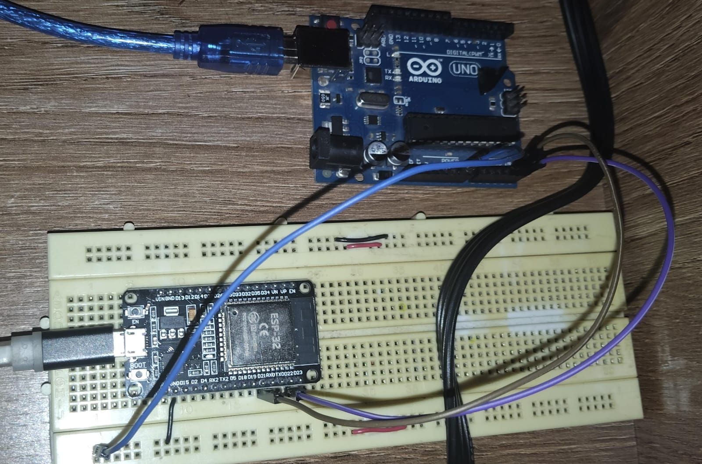

# Ejercicio 5 - Reto 2 - Arduino

Este proyecto corresponde al **Reto 2** de ejercicios con Arduino.  
Incluye un diagrama del circuito, el código fuente en Arduino y un enlace al diseño en Tinkercad.  

---

## 📂 Archivos del proyecto

- `reto2_maestro.ino` → Código 1 en Arduino.
- `reto2_esclavo.ino` → Código 2 en Arduino.
- `assets/reto2.png` → Imagen del circuito.
- `README.md` → Documentación del proyecto.

---

## 📝 Descripción

### Comunicación Maestro–Esclavo: 
- Envía un número desde el maestro y haz que el esclavo lo reciba e imprima en el monitor serial.

El diseño se puede visualizar tanto en la imagen incluida como en la simulación en Tinkercad.

---

## 🖼️ Circuito

---

✍️ Autor: Danny
