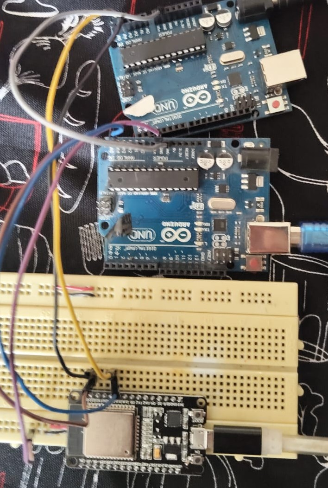

# Ejercicio 5 - Reto 4 - Arduino

Este proyecto corresponde al **Reto 4** de ejercicios con Arduino.  
Incluye un diagrama del circuito, el código fuente en Arduino y un enlace al diseño en Tinkercad.  

---

## 📂 Archivos del proyecto

- `reto4_esclavo.ino` → Código 1 en Arduino.
- `reto4_maestro1.ino` → Código 2 en Arduino.
- `reto4_maestro2.ino` → Código 3 en Arduino.
- `assets/reto4.png` → Imagen del circuito.
- `README.md` → Documentación del proyecto.

---

## 📝 Descripción

### Red de Dispositivos: 
- Conecta dos Arduinos/ESP32 (maestros) y un esclavo sensor, donde los maestros soliciten información en diferentes momentos.

---

## 🖼️ Circuito

---

✍️ Autor: Danny
