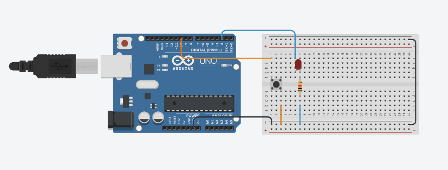

# Reto 1 - Arduino

Este proyecto corresponde al **Reto 1** de ejercicios con Arduino.  
Incluye un diagrama del circuito, el código fuente en Arduino y un enlace al diseño en Tinkercad.  

---

## 📂 Archivos del proyecto

- `reto1.ino` → Código en Arduino.
- `assets/reto1.png` → Imagen del circuito.
- `README.md` → Documentación del proyecto.

---

## 📝 Descripción

### Encender LED con pulsador (Modo Toggle)

- Usar un botón y un LED.
- Cada vez que se presiona el botón, el LED cambiará de estado (si está apagado, se enciende, y viceversa).
- Utilice una variable para almacenar el estado del LED.

El diseño se puede visualizar tanto en la imagen incluida como en la simulación en Tinkercad.

---

## 🖼️ Circuito

---

## 🔗 Simulación en Tinkercad

Puedes ver y simular el circuito en el siguiente enlace:  
👉 [Abrir en Tinkercad](https://www.tinkercad.com/things/aU5Bla94Zqe-copy-of-puente-h-con-transistores/editel?returnTo=https%3A%2F%2Fwww.tinkercad.com%2Fdashboard)

---

✍️ Autor: Danny
