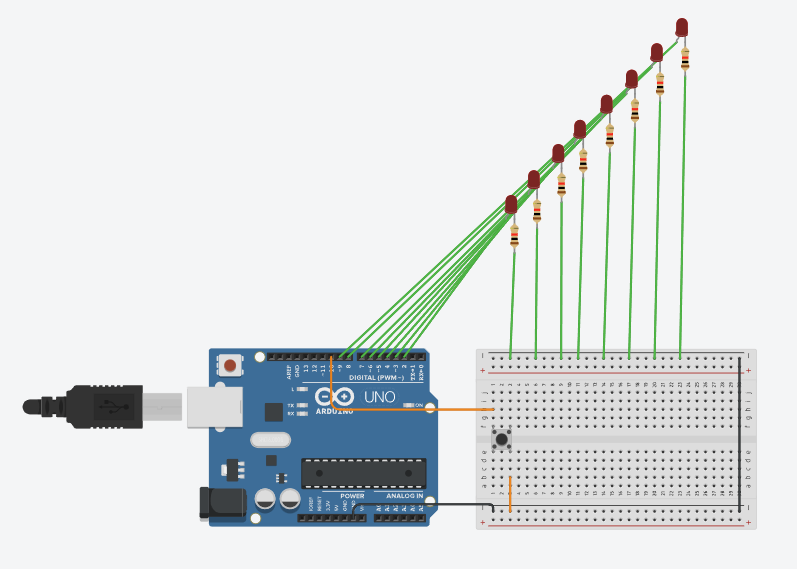

# Reto 2 - Arduino

Este proyecto corresponde al **Reto 2** de ejercicios con Arduino.  
Incluye un diagrama del circuito, el código fuente en Arduino y un enlace al diseño en Tinkercad.  

---

## 📂 Archivos del proyecto

- `reto2.ino` → Código en Arduino.
- `assets/reto2.png` → Imagen del circuito.
- `README.md` → Documentación del proyecto.

---

## 📝 Descripción

### Secuencia de LED

- Usando 8 LEDs.
- Al presionar el botón, los LED deben encenderse en secuencia.
- Al soltarlo, los LED deben apagarse en orden inverso.  

El diseño se puede visualizar tanto en la imagen incluida como en la simulación en Tinkercad.

---

## 🖼️ Circuito

---

## 🔗 Simulación en Tinkercad

Puedes ver y simular el circuito en el siguiente enlace:  
👉 [Abrir en Tinkercad](https://www.tinkercad.com/things/c3ZRkggKoeE-daring-habbi-wolt/editel?returnTo=https%3A%2F%2Fwww.tinkercad.com%2Fdashboard%2Fdesigns%2Fcircuits)

---

✍️ Autor: Danny
