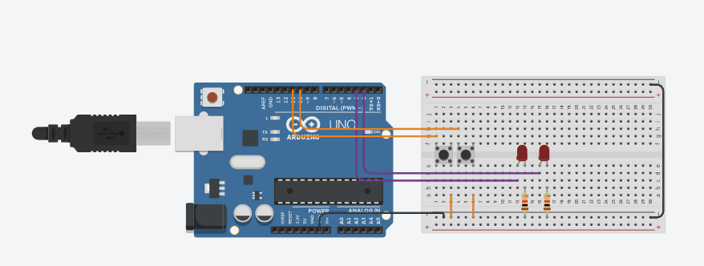

# Reto 3 - Arduino

Este proyecto corresponde al **Reto 3** de ejercicios con Arduino.  
Incluye un diagrama del circuito, el código fuente en Arduino y un enlace al diseño en Tinkercad.  

---

## 📂 Archivos del proyecto

- `reto3.ino` → Código en Arduino.
- `assets/reto3.png` → Imagen del circuito.
- `README.md` → Documentación del proyecto.

---

## 📝 Descripción

### Luz de emergencia

- Usar dos LED de diferente color.
- Un botón activará un parpadeo alternativo entre los LED.
- Otro botón detendrá el parpadeo. 

El diseño se puede visualizar tanto en la imagen incluida como en la simulación en Tinkercad.

---

## 🖼️ Circuito

---

## 🔗 Simulación en Tinkercad

Puedes ver y simular el circuito en el siguiente enlace:  
👉 [Abrir en Tinkercad](https://www.tinkercad.com/things/3jyEzmSJcx8-copy-of-arduino-mosfet-h-bridge/editel?returnTo=https%3A%2F%2Fwww.tinkercad.com%2Fdashboard%2Fdesigns%2Fcircuits)

---

✍️ Autor: Danny
