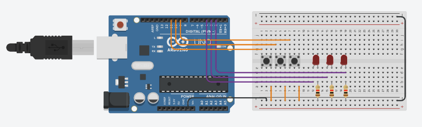

# Reto 6 - Arduino

Este proyecto corresponde al **Reto 6** de ejercicios con Arduino.  
Incluye un diagrama del circuito, el código fuente en Arduino y un enlace al diseño en Tinkercad.  

---

## 📂 Archivos del proyecto

- `reto6.ino` → Código en Arduino.
- `assets/reto6.png` → Imagen del circuito.
- `README.md` → Documentación del proyecto.

---

## 📝 Descripción

### Memoria de Secuencia (Juego de Simón)

- Usar varios LED y botones.
- Cree una secuencia de encendido de LED.
- El usuario deberá repetir la secuencia con los botones.
- Si la secuencia es correcta, se genera una nueva más larga.
- Si es incorrecto, el juego se reinicia.

El diseño se puede visualizar tanto en la imagen incluida como en la simulación en Tinkercad.

---

## 🖼️ Circuito

---

## 🔗 Simulación en Tinkercad

Puedes ver y simular el circuito en el siguiente enlace:  
👉 [Abrir en Tinkercad](https://www.tinkercad.com/things/aqLI5IF8dOI-cool-robo-jaiks/editel?returnTo=https%3A%2F%2Fwww.tinkercad.com%2Fdashboard%2Fdesigns%2Fcircuits)

---

✍️ Autor: Danny
