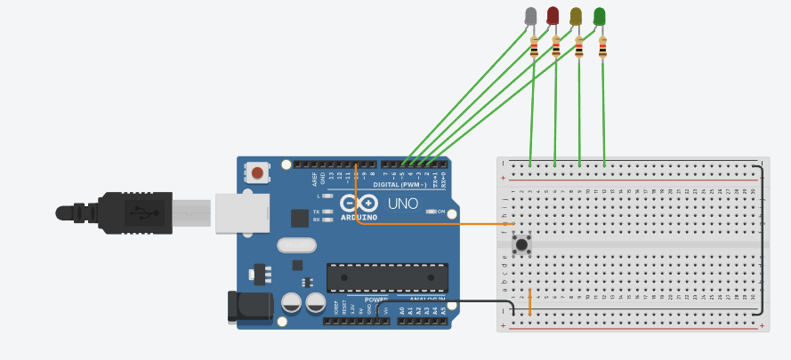

# Ejercicio 1 - Reto 7 - Arduino

Este proyecto corresponde al **Reto 7** de ejercicios con Arduino.  
Incluye un diagrama del circuito, el código fuente en Arduino y un enlace al diseño en Tinkercad.  

---

## 📂 Archivos del proyecto

- `reto7.ino` → Código en Arduino.
- `assets/reto7.png` → Imagen del circuito.
- `README.md` → Documentación del proyecto.

---

## 📝 Descripción

### Semáforo con Peatón

- Usar tres LED para simular un semáforo (rojo, amarillo, verde).
- Un botón activará la fase de cruce peatonal.
- La secuencia debe ser:
  - Luz verde encendida normalmente.
  - Al presionar el botón, la luz amarilla se enciende por un tiempo.
  - Luego, la luz roja se enciende y se activa un LED peatonal.
  - Pasado un tiempo, se vuelve a la luz verde.  
  
El diseño se puede visualizar tanto en la imagen incluida como en la simulación en Tinkercad.

---

## 🖼️ Circuito

---

## 🔗 Simulación en Tinkercad

Puedes ver y simular el circuito en el siguiente enlace:  
👉 [Abrir en Tinkercad](https://www.tinkercad.com/things/hhDlAyWQNcF-copy-of-flip-flop-clase/editel?returnTo=https%3A%2F%2Fwww.tinkercad.com%2Fdashboard%2Fdesigns%2Fcircuits)

---

✍️ Autor: Danny
